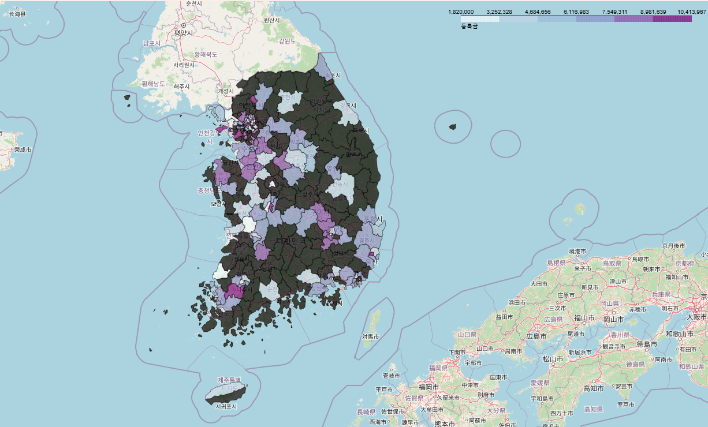
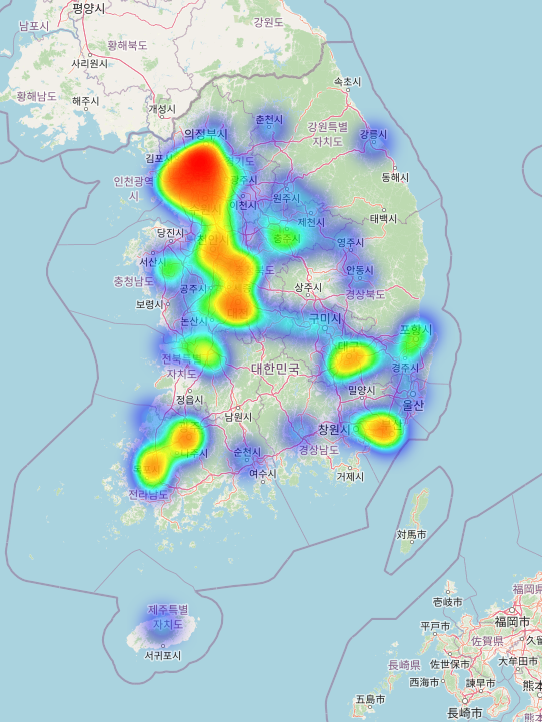

# README 작성
> 대학알리미, 2024 대학교 등록금 현황 데이터 사용

## 1. tuitionAnalysis
해당 파일은 등록금 파일을 기반으로 다음 작업을 수행한 파일입니다.
각각의 주석을 해제하여 실행하시면 됩니다.
1. 지역별 등록금 평균(barplot)
2. 지역별 학교 개수 (histplot)
3. 국립, 사립, 특별으로 등록금 비교(barplot)
4. 지역별 국립, 사립, 특별로 등록금 현황 확인(barplot)
5. 수업료, 등록금 관계 확인(scatterplot)

## 2. tuitionMap
해당 파일은 등록금 분석 파일을 기반으로 다음 작업을 수행한 파일입니다.
1. 대학 소재지가 도로명 주소로 적혀있는 데이터셋을 공공데이터포털에서 다운받았습니다.
2. 해당 파일의 소재지도로명주소를 기반으로 시-구 까지 영역을 나누었습니다.
3. folium(시각화 라이브러리)를 이용하여 지도를 생성하였습니다.
 

 

**개선사항**
1. 해당 지도의 표시되지 않은 대학들이 많음
(데이터 셋에 없는 대학인지, 데이터 처리 과정에서 누락된 것인지 확인)
2. 사립, 공립으로 나누어서 지도 만들어보기
3. 다른 시각화 라이브러리 고민해보기

## 3. heapMap
해당 파일은 등록금 분석 파일을 기반으로 다음 작업을 수행한 파일입니다.
 
geopy라이브러리를 사용해서 주소(도로명주소)가 입력된 데이터 소스를 사용하여 좌표로 변환함.
 <Nominatim 지오코딩 서비스를 사용하여 지번 주소를 위도, 경도로 변환>
 

**개선사항**
1. 도로명주소에서 좌표로 변환이 안되는 주소들이 존재, 대학 수가 적어짐
2. 도로명주소에서 좌표(위도, 경도)로 변환시 시간이 굉장히 오래 걸림
